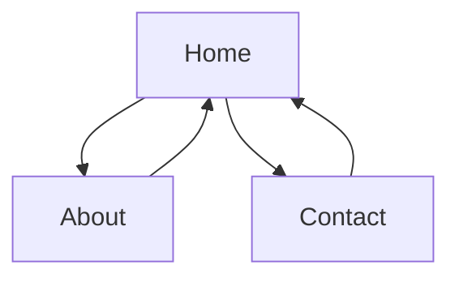
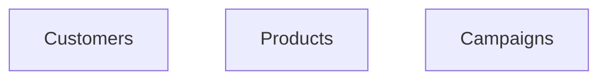

# Landing Page
## A generic landing page app
### Pages
  - home
  - about
  - contact

  
### Home page
#### Description
The Home page displays a blurb about the product.

About page and Contact page are accessed by Nav buttons 

Contact page is a form to order the product or ask questions about it.
#### Implementation
##### Page
home.html
```
[[extend "layout.html"]]
<h1>Home Page</h1>
```
##### Data
models.py
- customers
- products
- campaigns

### About page
.
'

### Contact page
'
'

## Implementation
Now that overview/diagram is done, start making components.
  - Make .html for each page
    - each page contains
    ```
    [[extend "layout.html"]]
    <h1>name of Page</h1>
    ```
  - Add @action, ... for each page
    ```
    @action("contact")
    @action.uses("contact.html")
    def contact():
    '
    .
    ```
  - Add db.define for each table to models.py
    ```
    db.define_table('products',
                Field('name'),
                Field('price', type='decimal(5,2)'),
                Field('desc', type='text'),
                Field('campaigns', 'list:reference campaigns'),
                )
  
## Note
For full implementation, CRUD forms for each table would be required - but, for just a landing page, that would be in the mother site and the landing page would send each captured contact to that by HTTP transaction
